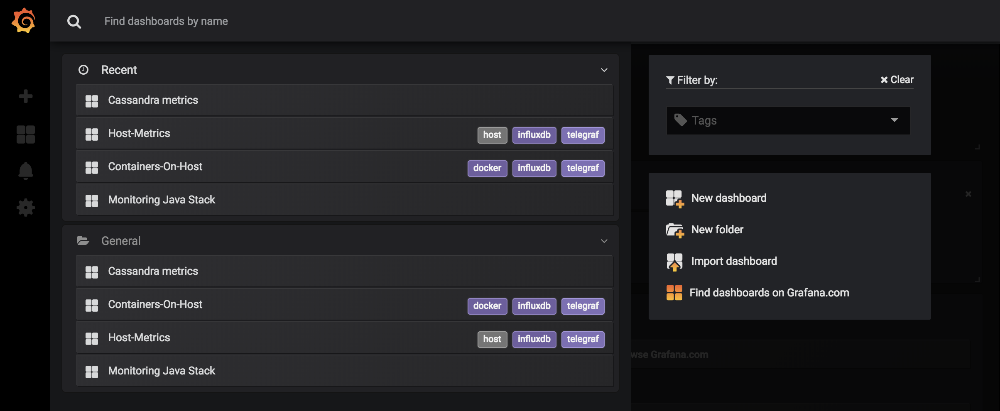
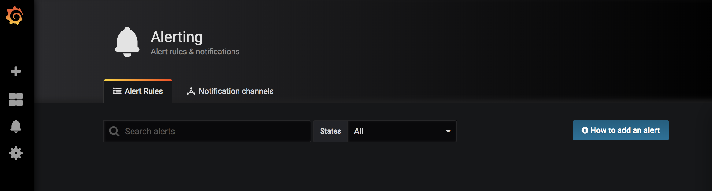
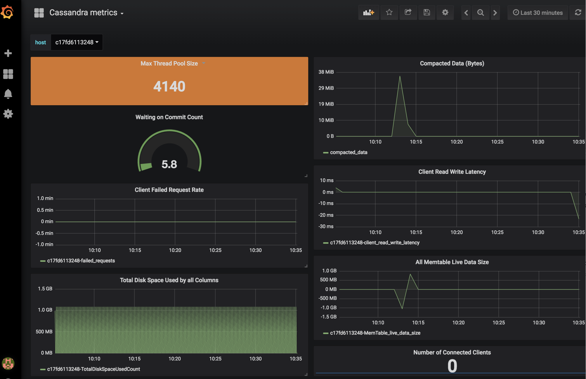
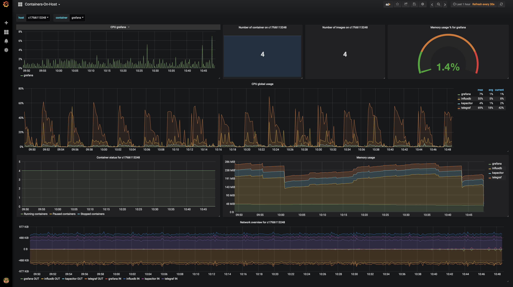
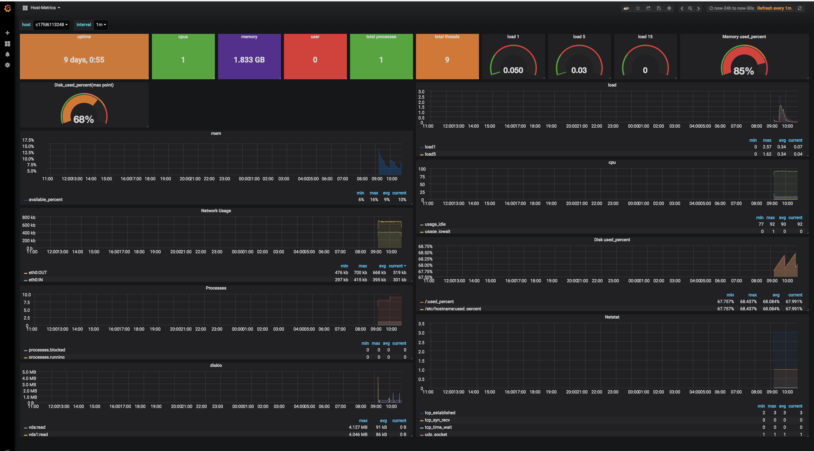
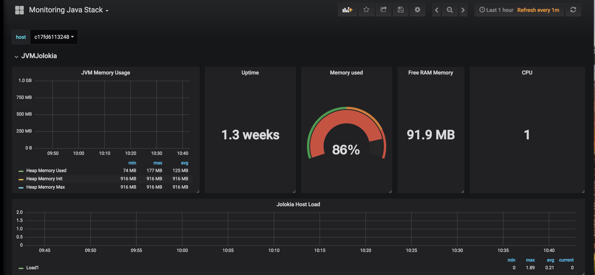

# Automated steps for monitoring Cassandra server and clients using the TIG stack

## Prerequisite
1. Make sure you have a cassandra server running on the server where the monitoring stack is being deployed.
2. Download the jolokia jvm agent (https://jolokia.org/download.html) and add the agent to the cassandra env file (cassandra-env.sh) by adding this line to the end of cassandra-env.sh

```bash
JVM_OPTS="$JVM_OPTS -javaagent:$CASSANDRA_HOME/lib/jolokia-jvm-1.5.0-agent.jar=port=8778,host=0.0.0.0"
```
3. Docker is running with docker-compose. Refer https://docs.docker.com/compose/install/ for instructions on how to install docker-compose.

## Step to start the monitoring stack

```bash
# start the cassandra monitoring stack
./start-monitoring-stack.sh
```
This will get the ip of the localhost and point the telegraf agent to collect jvm and cassandra metrics and push them to the influxdb. 
These metrics are then fed to grafana to create a few pre-populated dashboards.














##Step to destroy the monitoring stack.

```bash
# stop the cassandra monitoring stack
docker-compose down
```
